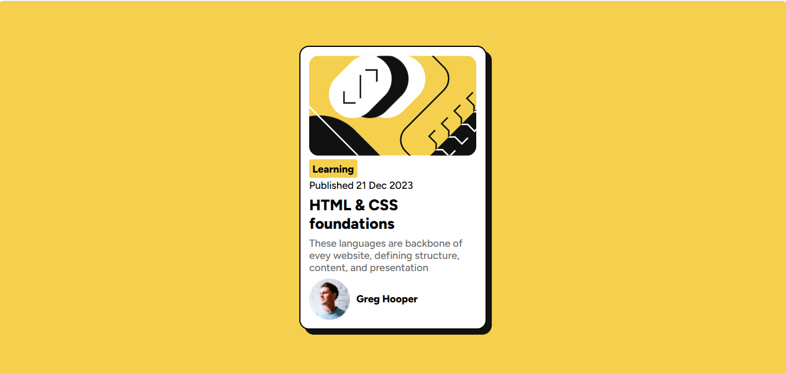
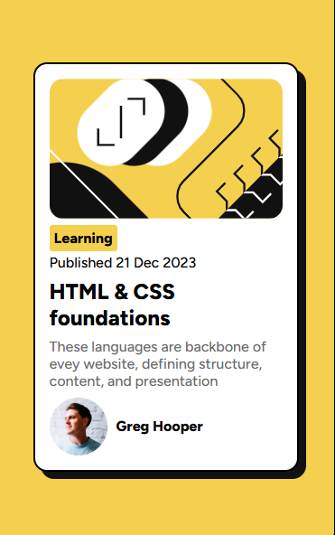

# Blog Preview Card

## Overview
A blog preview card component from Frontend Mentor featuring a modern card design with image, category badge, publication date, title, description, and author information.

## Screenshot

### Desktop View

### Mobile View

## Links
- Live Site URL: [https://app.netlify.com/projects/blogpreviewcard8675/overview]
- Solution URL: [https://github.com/Laiba768/Blog-preview-card]

## Built with
- HTML5
- CSS3
- Flexbox

## What I learned

This challenge was different from my previous QR code project because it introduced box shadows and more complex spacing management.

I learned how to properly control card dimensions using padding and gap. Initially, the card became too large, but when I reduced the padding and gap values, it fit perfectly to match the design. I also learned that setting image width to 100% makes it responsive and fit inside its container.

I'm proud that I made the card responsive without using media queries. I struggled with centering the card at first, but once I applied Flexbox to the body with `justify-content: center` and `align-items: center`, everything aligned perfectly.

The key lessons were:
- Understanding how padding and gap affect overall card height
- Using `width: 100%` on images for responsive sizing
- Centering elements with Flexbox properties
- Creating box shadows for depth

## Challenges and Solutions

**Challenge 1: Card Height**
The card was too tall initially. I solved this by reducing both padding (from 24px to 16px) and gap (from 16px to 8px) between elements.

**Challenge 2: Image Sizing**
The image was overflowing outside the card. Setting `width: 100%` on the image made it fit perfectly inside its container.

**Challenge 3: Centering**
I struggled to center the card on the page. Adding `display: flex`, `justify-content: center`, and `align-items: center` to the body element centered it both horizontally and vertically.

## Author
- Frontend Mentor - [@LaibaShahzadi]